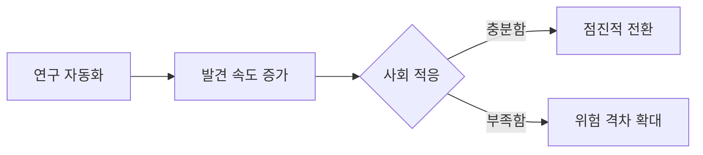

# 특이점이 온다: GFM 렌더링 점검 문서

> 이 문서는 미래 예측의 정답을 제시하기보다, Codex Workbench의 파일 미리보기와 채팅 버블에서 GitHub Flavored Markdown이 일관되게 보이는지 확인하기 위한 샘플이다.

## 1. 특이점이란 무엇인가

기술적 특이점은 인공지능의 발전 속도가 인간의 장기 예측 범위를 넘어서는 가설적 전환점을 뜻한다. **급격한 발전**을 강조하는 관점도 있고, *사회적 적응*이 더 중요하다는 관점도 있다. ~~내일 당장 모든 것이 바뀐다~~ 같은 단정은 경계할 필요가 있다.

HTML 줄바꿈 확인: A<br>B<br />C<br/>D

GFM hard break 확인: 이 문장 끝에는 공백이 두 칸 있다.  
그러므로 다음 줄로 내려간다.  
이 문장 끝에는 역슬래시가 있다.\
이 줄도 강제로 내려간다.

이 두 줄은 일반 줄바꿈만 사용한다.
GFM soft break이므로 같은 문단 안에서 자연스럽게 이어져야 한다.

인라인 코드는 `<br>`처럼 HTML로 해석되지 않아야 하며, 특수 문자는 \*그대로\* 표시할 수 있다.

## 2. 핵심 주장과 반론

### 발전을 가속하는 요소

- 더 큰 연산 자원과 효율적인 학습 알고리즘
- 사람이 만든 도구를 사용하는 에이전트
  - 코드 작성과 검증
  - 과학 문헌 탐색
- 합성 데이터와 시뮬레이션

### 확인해야 할 체크리스트

- [x] 성능 향상과 실제 신뢰성을 구분한다.
- [x] 경제적 효과와 안전 비용을 함께 본다.
- [ ] 예측이 빗나갔을 때의 수정 기준을 명시한다.
- [ ] 혜택이 누구에게 돌아가는지 측정한다.

5. 번호가 5부터 시작하는 목록
6. 능력, 비용, 접근성을 각각 추적
7. 한 지표만으로 결론 내리지 않기

> “특이점”은 하나의 날짜라기보다 여러 기술과 제도가 서로 영향을 주는 과정일 수 있다.
>
> > 중첩 인용문도 별도의 깊이로 보여야 한다.

## 3. 시나리오 비교

| 시나리오 | 발전 속도 | 사회 적응 | 관찰할 신호 |
|:---|:---:|---:|---|
| 점진적 확산 | 중간 | 높음 | 생산성 통계, 직무 재설계 |
| 국소적 도약 | 높음 | 중간 | 특정 연구 분야의 자동화 |
| 급격한 전환 | 매우 높음 | 낮음 | 자기 개선 주기의 단축 |

표 안의 파이프는 코드로 보호한다: `능력 | 안전`, 그리고 **강조**도 렌더링된다.

## 4. 링크, 이미지, 접기

[참조 링크][singularity]와 <https://github.github.com/gfm/> 같은 자동 링크를 확인한다. `www.example.com`도 GFM 자동 링크 대상이며, test@example.com은 이메일 자동 링크 대상이다.


[singularity]: https://en.wikipedia.org/wiki/Technological_singularity "기술적 특이점"

<details>
<summary>HTML 허용 목록 점검</summary>

안전한 접기 영역과 <kbd>Enter</kbd>, H<sub>2</sub>O, 2<sup>10</sup>, <mark>핵심 표시</mark>가 유지되어야 한다.

</details>

## 5. 코드와 다이어그램

```python
def estimate_transition(capability, adaptation):
    """예측값이 아니라 비교용 예제다."""
    gap = max(0.0, capability - adaptation)
    return {"gap": gap, "review_required": gap > 0.4}

print(estimate_transition(0.82, 0.55))
```



---

## 6. 렌더링 완료 기준

1. 제목, 강조, 취소선, 인라인 코드가 구분된다.
2. `<br>` 세 형태와 두 종류의 hard break가 실제 개행된다.
3. 표가 가로로 넘칠 때 컨테이너 안에서 스크롤된다.
4. 체크박스는 비활성 상태로 표시되고 중첩 목록이 유지된다.
5. 외부 링크는 새 탭 정책을 따르고, 이미지 너비는 본문을 넘지 않는다.
6. Python 코드는 채팅 버블에서 줄번호와 함께 보이고 Mermaid는 다이어그램으로 변환된다.
7. 원문에 `<script>alert('실행되면 안 됨')</script>`가 있더라도 스크립트 태그는 실행되지 않는다.

마지막 문장이다. 파일 미리보기와 채팅 버블이 같은 결과를 보여주면 점검을 통과한다.
